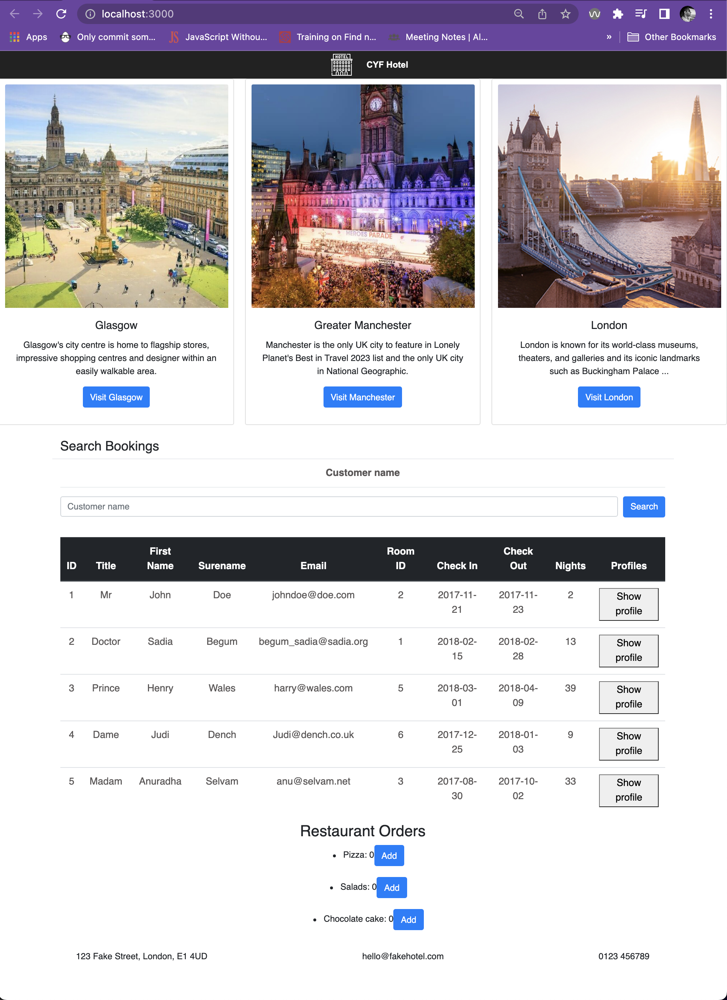

A hotel booking application in React. Homework for the [CodeYourFuture React module](https://codeyourfuture.github.io/syllabus-master/react/)



# Installation

1. Follow [the instructions](https://codeyourfuture.github.io/syllabus-master/others/making-a-pull-request.html#how-to-fork-a-github-repo) to fork & clone the GitHub repo
2. Install the dependencies by running `npm install`
3. Launch the server using `npm start`
4. It should automatically open `http://localhost:3000/` in your browser

# Exercises

## Lesson 1

#### 1. Extract the search button in its own component

**Instructions:** Extract the search `<button>` from the `src/Search.js` file to be its own separate component. You can name it `SearchButton`. Import and use this new component in `src/Search.js`.

**Test:** The search button should still render on the page.

#### 2. Extract the header in its own component

**Instructions:** Extract the `<header>` from the `src/App.js` file to be its own separate component called `Heading`. Make sure that you import and render the `<Heading />` component within `src/App.js`. In the `Heading` component, render the hotel's logo in an `` (you can use `https://image.flaticon.com/icons/svg/139/139899.svg` or find your own image URL). You can adjust the CSS by editing `src/App.css` to make your Heading looks better if necessary.

**Test:** The header should be displayed with a logo on the page.

#### 3. Create and use a new component to show info cards

**Instructions:** In `src/App.js`, above the `<Bookings />` component add a new component called `TouristInfoCards` which shows 3 _cards_. A card is a common user interface pattern with an image at the top and some related text underneath. The cards must link to `peoplemakeglasgow.com`, `visitmanchester.com` and `visitlondon.com`. The cards should contain the name of the city and an image of the city.

**Hint:** Use the same className as the example below to benefit from [Bootstrap](https://getbootstrap.com/docs/4.2/components/card) library which is already imported for you in the project. Use the JSX code below as an example of one card (note that in JSX, you'll need to use `className` instead of `class`):

```
<div className="card">
	
	<div className="card-body">
		<a href="#" className="btn btn-primary">Go somewhere</a>
	</div>
</div>
```

**Test:** 3 info cards should be displayed on the page for each city (Glasgow, Manchester, London). Each card should link to the correct website.

#### 4. Create a Footer component

**Instructions:** Create a `<Footer />` component which should be rendered at the bottom of the page. Pass the following array as a prop to this component: `["123 Fake Street, London, E1 4UD", "hello@fakehotel.com", "0123 456789"]`. Inside the component, use the data you passed as a prop to render a `<ul>` list with each item of the array displayed as a `<li>`.

**Hint:** The `.map()` method will by useful.

**Test:** The footer should render at the bottom of the page with each address property displayed as a list item.

#### 5. Create a table to show hotel bookings

**Instructions:** Create a `<SearchResults />` component that shows hotel bookings in a `<table>` element. Each booking will have an `id`, `title`, `first name`, `surname`, `email`, `room id`, `check in date` and `check out date`. You can make up data in the `<SearchResults />` component to show in the table. Then show `<SearchResults />` component within the `<Bookings />` component that is provided. Be sure to split out your components into small well-named components, similar to the method used in exercise 1.

**Hint:** You will find some useful `<table>` examples in the [Bootstrap documentation for tables](https://getbootstrap.com/docs/4.2/content/tables/#examples).

**Test:** A table should render with a column for each booking attribute. The table can show more than one booking. The bookings that are displayed can be made up and hardcoded for now.

#### 6. Show more bookings in the table

**Instructions:** Instead of using your hard-coded data in the `<SearchResults />` component, load data from the `src/data/fakeBookings.json` file in the `<Bookings />` component and pass it as a prop to `<SearchResults />`. All the bookings in `src/data/fakeBookings.json` should now be displayed in your table.

**Hint:** Look in the `<Bookings />` component for how to import data from a JSON file.

**Test:** All the bookings in the file `src/data/fakeBookings.json` should be displayed in your table.

#### 7. Calculate and show the number of nights for each booking

**Instructions:** Add another column to your `<SearchResults />` table which shows the number of nights a guest is staying.

**Hint:** Try installing the [moment.js library](http://momentjs.com/) (you'll need to install it with `npm install moment --save`) and using the [`.diff()` method](http://momentjs.com/docs/#/displaying/difference/) to compare dates.

**Test:** Each booking in your table should show the number of nights in a separate column. For example, Mr John Doe has a booking for **2** nights.

### Lesson 2

8. Within `src/App.js`, render the `<Restaurant />` component (that is provided for you in `src/Restaurant.js`) underneath the `<Bookings />` component.

9. At the moment, the number of pizzas a guest can order is static and set to 0, even if they click on the 'Add' button. We will change that in the following to let a guest add more pizzas to their order. First, declare a new state variable `orders` along with the function to set the orders state `setOrders`. The initial value of the `orders` state should be **0**. Use the new `orders` variable instead of the `pizzas` variable (that you can now delete) and verify the number of ordered pizzas it still **0** on the screen. Hint: you need to use the React function `useState` to create a state variable. Remember to import the function at the top with `import React, {useState} from "react";`.

10. Add a `onClick` handler to the Add `<button>` that calls the `setOrders` function when it's being clicked. `setOrders` should be called with the new orders number to increment the `orders` state by 1. Try to click on the Add button a few times and verify that the number of pizzas increases accordingly.

11. While incrementing the number of pizzas works just fine, let's improve the code a little bit and extract the function from the `onClick` handler. Create a new function named `orderOne` in the `<Restaurant />` component. The `orderOne` function doesn't take any parameters and should use the `setOrders` function to increment the `orders` state variable by 1. Then, use the `orderOne` function in the `onClick` handler and verify that the number of pizzas is still incrementing when you click on the Add button.

12. Extract the `<button>` currently in the `<Restaurant />` component to a new component named `RestaurantButton`. Pass the `orderOne` function as a prop to the `<RestaurantButton />` component and use this prop in the `onClick` handler. Ensure that clicking the button still increments the number of pizzas.

13. Extract the `<li>` containing "Pizzas" from the `<Restaurant />` component to a new component named `Order`. Also, move the declaration of the `orders` state and the `orderOne` function from the `<Restaurant />` component to the new `<Order />` component. Use the `<Order />` component in the `<ul>` list of the `<Restaurant />` component. Make sure that clicking on the "Add" button still increments the number of orders.

14. Pass a new prop named `orderType` to the `<Order />` component with the value "Pizzas". Then render the `orderType` prop instead of "Pizzas" in the `<Order />` component. Make sure that "Pizzas" is still displayed on the screen. In the `<ul>` list of the `<Restaurant />` component, render 2 others `<Order />` components but this time pass different values for the `orderType` prop: "Salads" and "Chocolate cake". Verify that you can increment each number of items independently.

15. Instead of getting the existing bookings from the file `data/fakeBookings.json`, we will get and load the bookings from a remote API. In the `<Bookings />` component, use the React function `useEffect` to `console.log()` some text only when the page first renders on the screen. Verify that when you refresh the page, the text appears once in the console. Then, in the `useEffect` function, use the `fetch()` function to get data from `https://cyf-react.glitch.me`. Hints:

- Replace `FakeBookings` in the bookings state and initialise it with `[]` (because we haven't fetched any results yet!)
- After calling the `fetch()` function, use `.then()` to handle the response. Try looking at your Pokemon app that you worked on in class for an example
- When the response comes back, use `setBookings` to update the results

Verify the customers data are still displayed correctly in the table.

16. Within the `<SearchResults />` component or its child components, add an `onClick` handler to each row in the table (hint: on the `<tr>` element). When clicked, the row is "selected" and highlighted with a different colour. When clicked again, the row is unselected and the coloured highlighting is removed. Hint: use a new state variable for each row to record if the row is selected or not, and use this value to set a class to the `className` prop of the row.

### Lesson 3

15. Within your `<Header />` component, render the `<Clock />` component (that is provided for you in `src/Clock.js`). Fix the problem where the `setTimeout` timer is not **cleared** if the component is **unmounted**. Hint: look at the Clock exercise you did in class.
    **TODO: is this question still relevant with React Hooks? Need to verify this is still in line with what's taught in the syllabus.**

16. In the following, we will implement the functionality to search for a customer name given the text that has been typed into the customer name field. In the `src/Search.js` file, declare a new state variable named `searchInput` with the corresponding setter function `setSearchInput` (hint: use the React function `useState`). The initial value of the `searchInput` variable can be an empty string. Add a `value` property to the `<input>` tag that is set to the new `searchInput` state variable. Create a new function `handleSearchInput` taking an `event` parameter. This function should use the `setSearchInput` function to update the state variable `searchInput` with what the user typed in the input field (hint: use `event.target.value` to get the input value). Finally, add a `onChange` prop to the `<input>` tag that is set to the function `handleSearchInput`.

17. Still in the `<Search />` component, add a `onSubmit` handler to the `<form>` tag. When the form is submitted (try clicking the search button), get the value of the state `searchInput` and pass it as a parameter to the `search` prop function that has been provided for you (the `search` prop is passed from the `<Bookings />` component). Look in the console, you should see the text that is typed in the search input field when submitting the form (note: also your submit handler should take an `event` parameter and add the line `event.preventDefault()` to prevent the browser to implicitely submit the form).

18. In the `<Bookings />` component, declare a new state `bookings` with the corresponding setter function `setBookings` to hold the `FakeBookings` data (hint: the new state should be initialised with the `FakeBookings` variable). Instead of passing `FakeBookings` directly to the `<SearchResults />` component, pass the new `bookings` state variable. Check that the bookings are still rendered correctly in the page.

19. Still in the `<Bookings />` component, implement the `search` method. It must use the `searchVal` variable (that you just passed from the `<Search />` component) to **filter** the search results. The filter function should return bookings where `firstName` or `surname` match `searchVal`. Once filtered, use the `setBookings` function to update the results rendered in `<SearchResults />`. Verify that when you enter an existing first name or surname and submit the form, the results are filtered accordingly in the customers table.

20. Now show a _loading state_ in `<Bookings />` while the data from the server is being fetched. To test this, try loading data from `https://cyf-react.glitch.me/delayed`, which has a 5 second delay before returning the data. You will need to use another state to record when your application is loading data (this can be a boolean) and display a loading message whenever the application is loading data. Hint: try looking at your Pokemon app that you worked on in class for an example.

21. Finally, display an error message in `<Bookings />` if there is an HTTP error when fetching data from the server. To test this, try loading data from `https://cyf-react.glitch.me/error`, which will return a 500 HTTP error. Hint: Try looking at your Pokemon app that you worked on in class for an example.

### Stretch Goals

1. Add a form with `<input>`s for each of the booking fields (first name, surname, title, room id, check in date, check out date) to the bottom of the page. Submitting the form adds the booking to the result table. Note that the new booking won't persist if you refresh the page.

2. Add an `onClick` handler to the columns of the result table, which sorts the results ascending (A -> Z). Clicking the column again will reverse the sort order to descending (Z -> A). Hint: try using the `.sort()` method with a callback to do custom sorting
