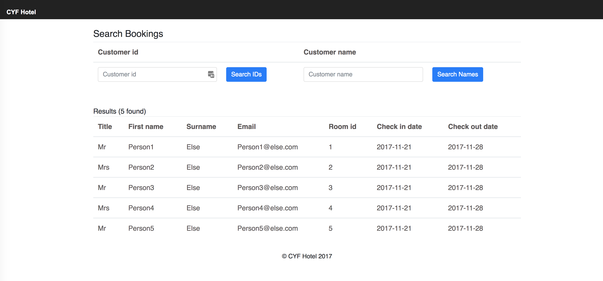

A hotel booking application in React. Homework for the [CodeYourFuture React module](https://codeyourfuture.github.io/syllabus-master/react/)



# Installation

1. Follow [the instructions](https://codeyourfuture.github.io/syllabus-master/others/making-a-pull-request.html#how-to-fork-a-github-repo) to fork & clone the GitHub repo
2. Install the dependencies by running `npm install`
3. Launch the server using `npm start`
4. It should automatically open `http://localhost:3000/` in your browser

# Exercises

## Lesson 1

#### 1. Extract the search button in its own component

**Instructions:** Extract the search `<button>` from the `src/Search.js` file to be its own separate component. You can name it `SearchButton`. Import and use this new component in `src/Search.js`.

**Test:** The search button should still render on the page.

#### 2. Extract the header in its own component

**Instructions:** Extract the `<header>` from the `src/App.js` file to be its own separate component called `Heading`. Make sure that you import and render the `<Heading />` component within `src/App.js`. In the `Heading` component, render the hotel's logo in an `` (you can use `https://image.flaticon.com/icons/svg/139/139899.svg` or find your own image URL). You can adjust the CSS by editing `src/App.css` to make your Heading looks better if necessary.

**Test:** The header should be displayed with a logo on the page.

#### 3. Create and use a new component to show info cards

**Instructions:** In `src/App.js`, above the `<Bookings />` component add a new component called `TouristInfoCards` which shows 3 _cards_. A card is a common user interface pattern with an image at the top and some related text underneath. The cards must link to `peoplemakeglasgow.com`, `visitmanchester.com` and `visitlondon.com`. The cards should contain the name of the city and an image of the city. Here is an example of what an info card should look like:


**Hint:** Use the same className as the example below to benefit from [Bootstrap](https://getbootstrap.com/docs/4.2/components/card) library which is already imported for you in the project. Use the JSX code below as an example of one card (note that in JSX, you'll need to use `className` instead of `class`):

```
<div className="card">
	
	<div className="card-body">
		<a href="#" className="btn btn-primary">Go somewhere</a>
	</div>
</div>
```

**Test:** 3 info cards should be displayed on the page for each city (Glasgow, Manchester, London). Each card should link to the correct website.

#### 4. Create a Footer component

**Instructions:** Create a `<Footer />` component which should be rendered at the bottom of the page. Pass the following array as a prop to this component: `["123 Fake Street, London, E1 4UD", "hello@fakehotel.com", "0123 456789"]`. Inside the component, use the data you passed as a prop to render a `<ul>` list with each item of the array displayed as a `<li>`.

**Hint:** The `.map()` method will by useful.

**Test:** The footer should render at the bottom of the page with each address property displayed as a list item.

#### 5. Create a table to show hotel bookings

**Instructions:** Create a `<SearchResults />` component that shows hotel bookings in a `<table>` element. Each booking will have an `id`, `title`, `first name`, `surname`, `email`, `room id`, `check in date` and `check out date`. You can make up data in the `<SearchResults />` component to show in the table. Then show `<SearchResults />` component within the `<Bookings />` component that is provided. Be sure to split out your components into small well-named components, similar to the method used in exercise 1.

**Hint:** You will find some useful `<table>` examples in the [Bootstrap documentation for tables](https://getbootstrap.com/docs/4.2/content/tables/#examples).

**Test:** A table should render with a column for each booking attribute. The table can show more than one booking. The bookings that are displayed can be made up and hardcoded for now.

#### 6. Show more bookings in the table

**Instructions:** Instead of using your hard-coded data in the `<SearchResults />` component, load data from the `src/data/fakeBookings.json` file in the `<Bookings />` component and pass it as a prop to `<SearchResults />`. All the bookings in `src/data/fakeBookings.json` should now be displayed in your table.

**Hint:** Look in the `<Bookings />` component for how to import data from a JSON file.

**Test:** All the bookings in the file `src/data/fakeBookings.json` should be displayed in your table.

#### 7. Calculate and show the number of nights for each booking

**Instructions:** Add another column to your `<SearchResults />` table which shows the number of nights a guest is staying.

**Hint:** Try installing the [moment.js library](http://momentjs.com/) (you'll need to install it with `npm install moment --save`) and using the [`.diff()` method](http://momentjs.com/docs/#/displaying/difference/) to compare dates.

**Test:** Each booking in your table should show the number of nights in a separate column. For example, Mr John Doe has a booking for **2** nights.

## Lesson 2

#### 8. Render the Restaurant component

**Instructions:** Within the `src/App.js` file, render the `<Restaurant />` component (that is provided for you in `src/Restaurant.js`) underneath the `<Bookings />` component.

**Test:** The restaurant orders should render on the page.

#### 9. Preparing to add more pizzas

**Instructions:** At the moment, the number of pizzas a guest can order is static and set to 0, even if they click on the 'Add' button. We will change that in the following to let a guest add more pizzas to their order. First, declare a new state variable `orders` along with the function to set the orders state `setOrders`. The initial value of the `orders` state should be **0**. Use the new `orders` variable instead of the `pizzas` variable (that you can now delete).

**Hint:** You need to use the React function `useState` to create a state variable. Remember to import the function at the top with `import React, {useState} from "react";`.

**Test:** Verify the number of ordered pizzas it still **0** on the screen.

#### 10. Add more pizzas

**Instructions:** In the `<Restaurant />` component, create a new function named `orderOne`. The `orderOne` function doesn't take any parameters and should use the `setOrders` function to increment the `orders` state variable by 1. Then, add a `onClick` handler to the Add `<button>` that calls the `orderOne` function when it's being clicked.

**Test:** Try to click on the Add button a few times and verify that the number of pizzas increases accordingly.

#### 11. Extract the Add button to its own component

**Instructions:** Extract the `<button>` currently in the `<Restaurant />` component to a new component named `RestaurantButton`. Pass the `orderOne` function as a prop to the `<RestaurantButton />` component and use this prop in the `onClick` handler.

**Test:** Clicking the button should still increment the number of pizzas.

#### 12. Extract pizza order to its own Order component

**Instructions:** Extract the `<li>` containing "Pizzas" from the `<Restaurant />` component to a new component named `Order`. Also, move the declaration of the `orders` state and the `orderOne` function from the `<Restaurant />` component to the new `<Order />` component. Use the `<Order />` component in the `<ul>` list of the `<Restaurant />` component.

**Test:** Make sure the pizza order is still rendered on the page and that clicking on the "Add" button still increments the number of orders.

#### 13. Render more orders

**Instructions:** Pass a new prop named `orderType` to the `<Order />` component with the value "Pizzas". Then render the `orderType` prop instead of "Pizzas" in the `<Order />` component. Make sure that "Pizzas" is still displayed on the screen. In the `<ul>` list of the `<Restaurant />` component, render 2 others `<Order />` components but this time pass different values for the `orderType` prop: "Salads" and "Chocolate cake".

**Test:** For each order, the number of items can be incremented independently. Verify that you are able to explain what is happening.

#### 14. Passing bookings from a state variable

**Instructions:** In the `<Bookings />` component, declare a new state `bookings` with the corresponding setter function `setBookings` to hold the `FakeBookings` data. Instead of passing `FakeBookings` directly to the `<SearchResults />` component, pass the new `bookings` state variable.

**Hint:** The new `bookings` state should be initialised with the `FakeBookings` variable.

**Test:** Check that the bookings are still rendered correctly in the page.

#### 15. Highlight booking row when clicked

**Instructions:** Within the `<SearchResults />` component or its child components, add an `onClick` handler to each row in the table (hint: on the `<tr>` element). When clicked, the row is "selected" and highlighted with a different colour. When clicked again, the row is unselected and the coloured highlighting is removed.

**Hint:** Use a new state variable for each row to record if the row is selected or not, and use this value to set a class to the `className` prop of the row.

**Test:** Verify that each row of your table can be highlighted (on and off) independently when being clicked.

## Lesson 3

#### 16. Load bookings remotely

**Instructions:** Instead of getting the existing bookings from the file `data/fakeBookings.json`, we will get and load the bookings from a remote API. In the `<Bookings />` component, use the React function `useEffect` to `console.log()` some text only when the page first renders on the screen. Verify that when you refresh the page, the text appears once in the console. Then, in the `useEffect` function, use the `fetch()` function to get data from `https://cyf-react.glitch.me`.

**Hints:**

- Replace `FakeBookings` in the bookings state and initialise it with `[]` (because we haven't fetched any results yet!)
- After calling the `fetch()` function, use `.then()` to handle the response. Try looking at your Pokemon app that you worked on in class for an example
- When the response comes back, use `setBookings` to update the results

**Test:** Verify the customers data are still displayed correctly in the table.

#### 17. Storing the search input in a state

**Instructions:** In the following, we will implement the functionality to search for a customer name given the text typed into the customer name field. In the `src/Search.js` file, declare a new state variable named `searchInput` with the corresponding setter function `setSearchInput` (hint: use the React function `useState`). The initial value of the `searchInput` variable can be an empty string. Add a `value` property to the `<input>` tag that is set to the new `searchInput` state variable. Create a new function `handleSearchInput` taking an `event` parameter. This function should use the `setSearchInput` function to update the state variable `searchInput` with what the user typed in the input field. Finally, add a `onChange` prop to the `<input>` tag that is set to the function `handleSearchInput`. Use `console.log()` to output the value received in the `handleSearchInput` function.

**Hint:** Use `event.target.value` to get the input value.

**Test:** In the developer console, check that everything you type in the search input is printed successively for each new character you enter.

#### 18. Triggering search when submitting the form

**Instructions:** Still in the `<Search />` component, add a `onSubmit` handler to the `<form>` tag. When the form is submitted (try clicking the search button), get the value of the state `searchInput` and pass it as a parameter to the `search` prop function that has been provided for you (the `search` prop is passed from the `<Bookings />` component).

**Note:** Also your submit handler should take an `event` parameter and add the line `event.preventDefault()` to prevent the browser to implicitely submit the form).

**Test:** Look in the console, you should see the text that is typed in the search input field when submitting the form.

#### 19. Implementing the search functionality

**Instructions:** Still in the `<Bookings />` component, implement the `search` method. It must use the `searchVal` variable (that you just passed from the `<Search />` component) to **filter** the search results. The filter function should return bookings where `firstName` or `surname` match `searchVal`. Once filtered, use the `setBookings` function to update the results rendered in `<SearchResults />`.

**Test:** Verify that when you enter an existing first name or surname and submit the form, the results are filtered accordingly in the customers table.

#### 20. Display a customer profile - step 1

**Instructions:** Add a new column in the table of the `<SearchResults />` component and display a `<button>` for each row. The text of the button should read "Show profile". Then, create a new `<CustomerProfile />` component. This component should be rendered next to the table in the `<SearchResults />` component. This component should receive one prop `id`. When clicking on a "Show profile" button for a given row, the component `<CustomerProfile />` should display the text "Customer <ID> Profile", where <ID> is the id of the selected customer. Initially, the `<CustomerProfile />` component doesn't show anything.

**Hint:** You need to record the selected customer id after clicking on a "Show profile" button. In which component do you think this state should be defined?

**Test:** When first showing the page, no customer profile is displayed. When clicking the first "Show profile" button of the table, the text "Customer 1 profile" appears. When clickong the second "Show profile" button of the table, the text "Customer 2 profile" appears instead.

#### 21. Display a customer profile - step 2

**Instructions:** When a "Show profile" button is clicked in the table, fetch the corresponding customer profile from `https://cyf-react.glitch.me/customers/<ID>` in the `<CustomerProfile />` component. A customer profile should show the customer ID, their email, if they are VIP and their phone number in a list.

**Hint:** You need to use `useEffect` and the correct dependency array. You'll need to fetch customers data from the API every time a "Show profile" button is clicked and render it accordingly.

**Test:** When you click on a "Show profile" button in the table, the corresponding customer profile is loaded and rendered on the screen.

#### 22. Show a loading message

**Instructions:** Do you remember in the Homework of the Lesson 2, we fetched the bookings from a remote API. Now show a _loading state_ in `<Bookings />` while the data from the server is being fetched. To test this, try loading data from `https://cyf-react.glitch.me/delayed`, which has a 5 second delay before returning the data. You will need to use another state to record when your application is loading data (this can be a boolean) and display a loading message whenever the application is loading data.

**Hint:** Try looking at your Pokemon app that you worked on in class for an example.

**Test:** A message inviting the user to wait should be displayed on the screen until bookings data can be rendered on the screen. When bookings are rendered, the loading message should be hidden.

#### 23. Show an error message

**Instructions:** Finally, display an error message in `<Bookings />` if there is an HTTP error when fetching data from the server. To test this, try loading data from `https://cyf-react.glitch.me/error`, which will return a 500 HTTP error.

**Hint:** Try looking at your Pokemon app that you worked on in class for an example.

**Test:** When loading bookings data from the `/error` endpoint, an error message should be displayed on the screen.

## Stretch Goals

#### 24. Create a new booking

**Instructions:** Add a form with `<input>`s for each of the booking fields (first name, surname, email, title, room id, check in date, check out date) and a 'Submit' `<button>` element to the bottom of the page. Submitting the form adds the booking to the result table. Note that the new booking won't persist if you refresh the page.

**Test:** When adding a new booking in the form, it should be displayed in the table.

#### 25. Sort table columns

**Instructions:** Add an `onClick` handler to the columns of the result table, which sorts the results ascending (A -> Z). Clicking the column again will reverse the sort order to descending (Z -> A).

**Hint:** Try using the `.sort()` method with a callback to do custom sorting.

**Test:** Each column in the table should be clickable to sort results in ascending or descending order.

#### 26. Validate new booking 

**Instructions:** Add validation to some fields from exercise 24: the first name and last name must not be empty, the email must contain exactly 1 `@` symbol, and at least one `.` symbol after the `@`; the room ID must be a number between 0 and 100. If the fields do not contain correct information when the 'Submit' button is pressed, display a red error message at the top of the page, but do not clear the text already in the field.

**Test:** An invalid input displays an error message after the 'Submit' button is pressed (e.g. an email like `react@com` is invalid). A valid input shows the correct values at the bottom of the page.

**Reflection:** Validating user input is an important part of any application. Without checking the input, you might see unexpected errors when working with the data later. 

What do you think would happen if you were asked to remove a booking for room number '81', but the user had typed 'eightyOne' or 'EIGHTY ONE'?

#### 27. Faster validation

**Instructions:** Improve the validation from the last exercise to check for correct values after each input changes, without the 'Submit' button being pressed. Show an 'X' with an explanation next to the field if it has invalid input (e.g. `X first name must not be empty`), and show 'OK' after it has valid input.

**Hint:** Try using the `onChange` function on the `<input>` element

**Test:** The 'Submit' button is initially not clickable, and becomes clickable once every field has the correct input.

**Reflection:** You have used native form validations in HTML. How have you improved this feature with React? 

As a user of this booking system, would you prefer:
- To find out you made a mistake when you submit the whole form?
- To find out you made a mistake after each input?

#### 28. Date picker

**Instructions:** Add the [js-datepicker](https://www.npmjs.com/package/js-datepicker) package to your project using `npm install`, and import it at the top of the file. Add different IDs to your 'check in date' and 'check out date' `<input>` elements, then create two date pickers using `const checkInPicker = datepicker(YOUR_ID)` (where `YOUR_ID` is the ID you assigned to your check in/check out date elements). 

**Hint:** Read the [js-datepicker usage guide](https://www.npmjs.com/package/js-datepicker#basic-usage)

**Test:** The date picker appears when you click on the 'check in date' and 'check out date' input elements.

**Reflection:** Using `js-datepicker` in this exercise allows you to practice installing and working with packages in JavaScript. 

Packages contain new functions and properties to work with that may not be available in native JavaScript/HTML. Using packages can often save time instead of writing your own functions, as you are importing code that someone else has written. However, this can have downsides; not all packages are high quality, and some may have bugs or may reduce accessibility by recreating native elements (`js-datepicker` recreates HTML's native [datepicker](https://developer.mozilla.org/en-US/docs/Web/HTML/Element/input/date) element).

Think about some of the code you have written in this lesson - are there any packages available that might have helped you to complete the exercises?

For example, exercise 26 and 27 used validation. Searching npmjs.com for '[validate](https://www.npmjs.com/search?q=validate)' shows multiple packages, such as '[validator](https://www.npmjs.com/package/validator)' and '[Validate](https://www.npmjs.com/package/Validate)'. Open both of these packages in your browser, and consider the following questions:
- Is it clear what this package does? Will it solve my specific problem better than writing my own code?
- Do I trust that the code in this package is safe to run on my machine? Do other people trust this package? (Hint: look at weekly downloads, last update, dependents, and visit the repository)
- Is this package accessible? Will it work on all browsers?
- If I decide to use this package and it breaks, will I know how to fix it or replace it?
